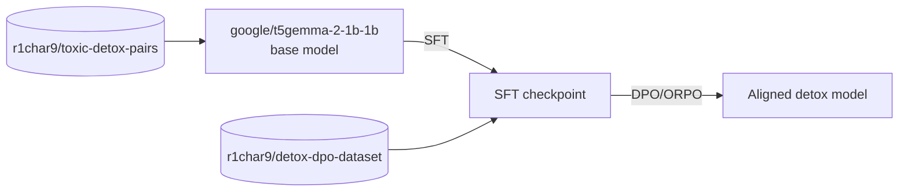

# Detoxification Alignment Pipeline

Итоговая модель выложена на Hugging Face Hub: [r1char9/t5gemma2-detox-ru](https://huggingface.co/r1char9/t5gemma2-detox-ru) .

Проект по детоксификации текста на русском и английском языках с использованием
двухэтапного alignment-пайплайна: **SFT** (Supervised Fine-Tuning) → **DPO/ORPO**
(preference-based дообучение на синтетических парах предпочтений).

Задача модели — переписывать токсичный текст в нейтральную форму, сохраняя исходный
смысл (`toxic_text → neutral_text`).

## Пайплайн



Пайплайн состоит из двух последовательных этапов дообучения одной и той же базовой
модели. Каждый следующий этап стартует с чекпоинта, полученного на предыдущем.

---

## Этап 1 — SFT (Supervised Fine-Tuning)

На первом этапе базовая модель дообучается напрямую на парах "токсичный текст —
нейтральный текст" в режиме supervised seq2seq обучения.

| | |
|---|---|
| **Базовая модель** | [`google/t5gemma-2-1b-1b`](https://huggingface.co/google/t5gemma-2-1b-1b) |
| **Датасет** | [`r1char9/toxic-detox-pairs`](https://huggingface.co/datasets/r1char9/toxic-detox-pairs) |
| **Формат данных** | `toxic_comment`, `neutral_comment`, `lang` (`ru` / `en`) |
| **Метод обучения** | Full/partial fine-tuning (`q_proj`, `k_proj`, `v_proj`, `o_proj`) |
| **Loss** | Cross-entropy (seq2seq) |
| **Метрика качества** | Косинусная близость эмбеддингов (LaBSE) между сгенерированным детокс-текстом и эталонным нейтральным текстом |

Цель этапа — научить модель базовому навыку детоксификации: убирать токсичную
лексику, сохраняя смысл высказывания. Результат — чекпоинт `model_best.pt`,
который становится стартовой точкой для следующего этапа.

---

## Этап 2 — DPO / ORPO (preference alignment)

SFT-модель дообучается на синтетических парах предпочтений, что позволяет точнее
выровнять поведение модели под желаемый стиль детоксификации — без потери
дообученных на этапе SFT навыков.

| | |
|---|---|
| **Стартовая модель** | SFT-чекпоинт из этапа 1 |
| **Датасет** | [`r1char9/detox-dpo-dataset`](https://huggingface.co/datasets/r1char9/detox-dpo-dataset) |
| **Формат данных** | `toxic_text`, `chosen`, `rejected` |
| **Источник разметки** | Пары `chosen` / `rejected` синтезированы моделью [`Qwen/Qwen3.6-35B-A3B-FP8`](https://huggingface.co/Qwen) |
| **Метод обучения** | DPO / ORPO (preference optimization без отдельной reward-модели) |

`chosen` — предпочтительный вариант детоксификации, `rejected` — менее удачный
(например, менее нейтральный, теряющий смысл, или сохраняющий часть токсичности).
Модель обучается напрямую увеличивать вероятность `chosen` относительно `rejected`
для одного и того же `toxic_text`, что дополнительно выравнивает стиль и качество
генераций поверх SFT-базы.

Обучение на этом этапе выполнялось с использованием FSDP — параметры, градиенты и состояния оптимизатора шардируются между устройствами, что позволяет дообучать модель на нескольких GPU без полного дублирования весов на каждом из них.

## Метрики

- **Train/Eval loss** — стандартный cross-entropy loss на этапе SFT.
- **Mean similarity** — средняя косинусная близость (LaBSE embeddings) между
  сгенерированной детокс-версией и эталонным нейтральным текстом; служит основной
  метрикой качества и критерием для сохранения лучшего чекпоинта.
- Логирование экспериментов — через **MLflow** (`mlflow ui` для просмотра).

## Запуск
```bash
mlflow server --host 0.0.0.0 --port 1234
```

```bash
python run_sft.py
```

```bash
CUDA_VISIBLE_DEVICES=3,0 torchrun \
    --nproc_per_node=2 \
    dpo_training.py
```


Параметры обучения (модель, batch size, learning rate, планировщик и т.д.)
задаются в `sft_model_training.py` и `dpo_model_training.py`.
